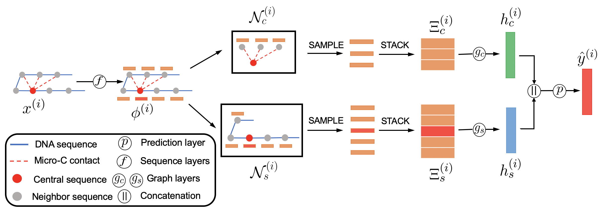
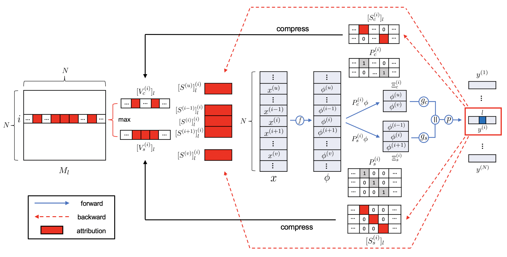

# ECHO


ECHO (Epigenomic feature analyzer with 3D CHromatin Organization), a graph neural network based model to predict the chromatin features and characterize the collaboration among them in 3D chromatin organization. 


<!-- ## Dependencies

*  python==3.8.5
*  torch==1.7.1
*  scikit-learn==0.23.2
*  numpy==1.19.2
*  scipy==1.5.2 -->


## Usage

For the usage of ECHO, we make two examples [echo_example.ipynb](echo_example.ipynb) and [neighborhood_motif.ipynb](neighborhood_motif.ipynb).

Please see [echo_example.ipynb](echo_example.ipynb) for an example to calulate prediction scores for the central sequence and attribution scores on chromatin contacts and neighbor sequences.

To perform your own analysis, you only need to provide an ATAC-seq file in (.bed) format. 

The chromatin contacts data will be provided by our 200-bp merged HFF and hESC Micro-C contact maps. The trained models are stored in https://github.com/liu-bioinfo-lab/echo/tree/main/models.

First, you need to download the Micro-C contact maps and GRCh38 reference genome data

```bash
pip install gdown
mkdir echo_data
gdown --id 1XAGqlZsZJ6CY2wQMVVvNXnlnVL9iEmtf --output HFF_Micro-C.zip
unzip HFF_Micro-C.zip -d echo_data
gdown --id 1aFK1wadoZ1h0Y0f6UTp76XWcbN5xqGe3 --output hESC_Micro-C.zip
unzip hESC_Micro-C.zip -d echo_data
gdown --id 11NXyB2FNehMRw_lbCe7_Ymlp86w5TQdR --output reference_genome.zip
unzip reference_genome.zip -d echo_data
```
<!-- curl -L -o reference_genome.zip "https://drive.google.com/uc?export=download&id=11NXyB2FNehMRw_lbCe7_Ymlp86w5TQdR"
unzip reference_genome.zip
curl -L -o HFF_Micro-C.zip "https://drive.google.com/uc?export=download&id=1XAGqlZsZJ6CY2wQMVVvNXnlnVL9iEmtf"
unzip HFF_Micro-C.zip
curl -L -o hESC_Micro-C.zip "https://drive.google.com/uc?export=download&id=1aFK1wadoZ1h0Y0f6UTp76XWcbN5xqGe3"
unzip hESC_Micro-C.zip
 -->

Then, you can generate the input data ('inputs','neighs','input_sample_poi'). p.s. if your uploaded ATAC-seq data is GRCh37(hg19), it will be converted to GRCh38(hg38).
```bash
from util import *
inputs,input_sample_poi=generate_input(ATAC_seq_file,version='hg38')
neighs= generate_neighbors(input_sample_poi)
```

Finally, you can follow the steps demonstrated in [echo_example.ipynb](echo_example.ipynb).

Please see [neighborhood_motif.ipynb](neighborhood_motif.ipynb) for an example to find common motif patterns in the nerighborhood for the inverstigated chromatin feature using [TF-MoDISco (Shrikumar et al.)](https://github.com/kundajelab/tfmodisco).

Refer to the code below, if you want to train the model from scratch. 

```bash 
python pre_train.py --lr=0.5 --pre_model=expecto --batchsize=64 --length=2600 --seq_length=1000
python hidden_extract.py --pre_model=expecto --length=2600
python graph_train.py --lr=0.5 --batchsize=64 --k_adj=50 --k_neigh=10 --pre_model=expecto
```


## Data

For the collected chromatin features profiles, please see [chromatin_feature_profiles.xlsx](https://github.com/liu-bioinfo-lab/echo/blob/main/doc/chromatin_feature_profiles.xlsx)

Please see https://drive.google.com/drive/folders/1rI9WRPb_MwM36sW6AH7INC63Vo5fVelb?usp=sharing for the data of labels

The neighhood data can be downloaded using the command lines below

```bash
pip install gdown
gdown --id 1nx8pRvG5CWkGQINS_f5Uk451A0Tt4NY5 --output neighbors_data.zip
unzip neighbors_data.zip
```

## Methods
### Model architecture

<div align=center></div>

### Applying attribution methods to ECHO

<div align=center></div>


<!-- ## Usage
In ```\utils\```, we provide the code for pre-processing data
### Model training
pre-train sequence layers 
```bash
python pre_train.py --lr=0.5 --pre_model=expecto --batchsize=64 --length=2600 --seq_length=1000
```
extracting hidden representations using pre-trained sequence layers 
```bash
python hidden_extract.py --pre_model=expecto --length=2600
```
training the graph layers with the extracted sequence hidden representations
```bash
python graph_train.py --lr=0.5 --batchsize=64 --k_adj=50 --k_neigh=10 --pre_model=expecto
```
Add ```--load_model``` for loading trained models, add ```--test``` for model testing.

In ```\models\```, we provide the trained models.
### Calculate attribution scores of Micro-C contact matrix
For the collected chromatin features profiles, please check  ```\doc\chromatin_feature_profiles.xlsx```
```bash 
python attribution_contact.py --chromatin_feature=ctcf --k_adj=50 --k_neigh=10
```
### Calculate attribution scores for the neighborhood 
e.g. attribute GM12878 H3k4me3 to the neighbor sequences 

First, get the corresponding attributed contact matrix
```bash
python attribution_contact.py --chromatin_feature=h3k4me3 --cell_line=gm12878
```
Next, calculate the attribution scores for selected neighbor sequences, patterns can be learnen from the neighbor sequences by using the tool TF-MoDISco
```bash
python attribution_neighborhood.py --chromatin_feature=h3k4me3 --cell_line=gm12878
```
 -->
